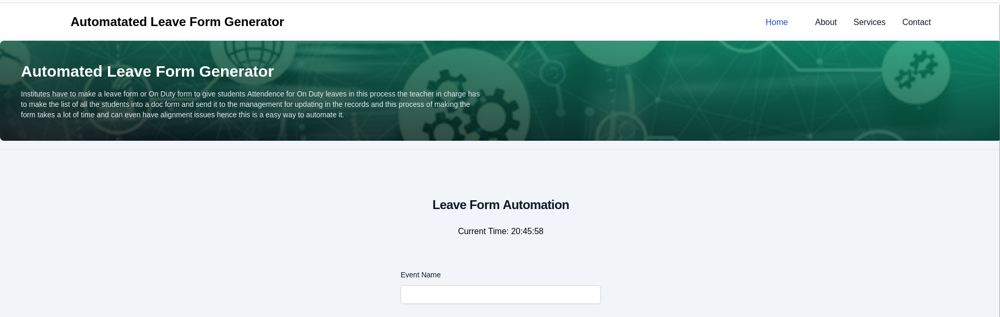
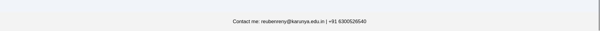
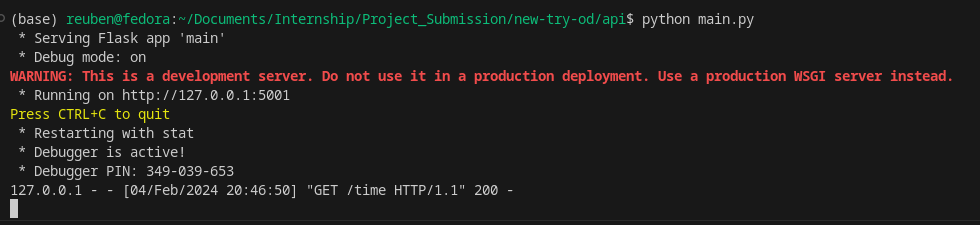
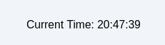
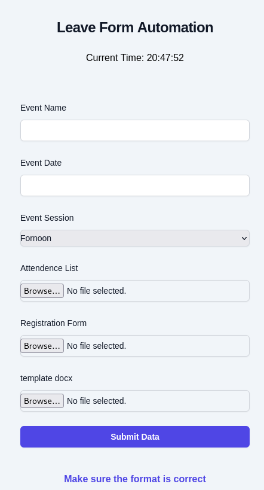

### Requirements
To run the app install the dependencies and go to the "api" folder and run "python main.py"
 
 

**Exercise 1: Setting Up a Simple Web Page** 

 

**Exercise 2: Creating a Python Web Server** 

 

**Exercise 3: Adding Dynamic Content**
 

 

**Exercise 4: Form Handling**
 

 

**Exercise 5: Data Persistence**
- Storing form submissions in a temp database for creating a new docx file
